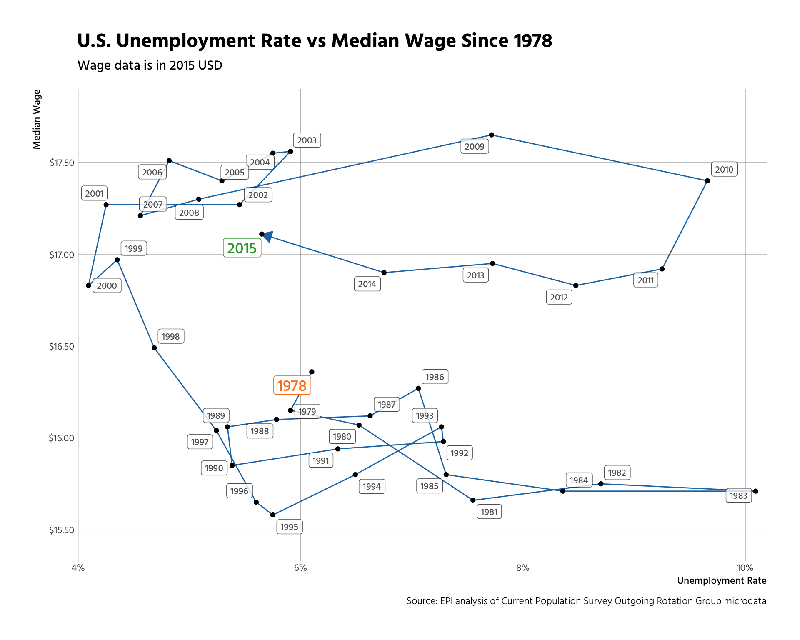

[](https://travis-ci.org/hrbrmstr/epidata)

`epidata` : Tools to Retrieve Economic Policy Institute Data Library Extracts

The [Economic Policy Institute](http://www.epi.org/data/) provides researchers, media, and the public with easily accessible, up-to-date, and comprehensive historical data on the American labor force. It is compiled from Economic Policy Institute analysis of government data sources. Use it to research wages, inequality, and other economic indicators over time and among demographic groups. Data is usually updated monthly.

The following functions are implemented:

-   `get_black_white_wage_gap`: Retreive the percent by which hourly wages of black workers are less than hourly wages of white workers
-   `get_college_wage_premium`: Retreive the percent by which hourly wages of college graduates exceed those of otherwise equivalent high school graduates
-   `get_employment_to_population_ratio`: Retreive the share of the civilian noninstitutional population that is employed
-   `get_gender_wage_gap`: Retreive the percent by which hourly wages of female workers are less than hourly wages of male workers
-   `get_hispanic_white_wage_gap`: Retreive the percent by which hourly wages of Hispanic workers are less than hourly wages of white workers
-   `get_labor_force_participation_rate`: Retreive the share of the civilian noninstitutional population that is in the labor force
-   `get_long_term_unemployment`: Retreive the share of the labor force that has been unemployed for six months or longer
-   `get_median_and_mean_wages`: Retreive the hourly wage in the middle of the wage distribution
-   `get_non_high_school_wage_penalty`: Retreive the percent by which hourly wages of workers without a high school diploma (or equivalent) are less than wages of otherwise equivalent workers who have graduated from high school
-   `get_underemployment`: Retreive the share of the labor force that is "underemployed"
-   `get_unemployment`: Retreive the share of the labor force without a job
-   `get_unemployment_by_state`: Retreive the share of the labor force without a job (by state)
-   `get_wages_by_education`: Retreive the average hourly wages of workers disaggregated by the highest level of education attained
-   `get_wages_by_percentile`: Retreive wages at ten distinct points in the wage distribution
-   `get_wage_ratios`: Retreive the level of inequality within the hourly wage distribution.

### Installation

``` r
devtools::install_github("hrbrmstr/epidata")
```

### Usage

``` r
library(epidata)

# current verison
packageVersion("epidata")
```

    ## [1] '0.1.0'

``` r
get_black_white_wage_gap()
```

    ## # A tibble: 43 × 8
    ##     date white_median white_average black_median black_average gap_median gap_average gap_regression_based
    ##    <int>        <dbl>         <dbl>        <dbl>         <dbl>      <dbl>       <dbl>                <dbl>
    ## 1   1973        17.19         19.68        13.50         15.43      0.215       0.216                0.124
    ## 2   1974        16.73         19.22        13.34         15.19      0.203       0.210                0.105
    ## 3   1975        16.54         19.23        13.43         15.14      0.188       0.213                0.107
    ## 4   1976        16.73         19.39        13.45         15.74      0.196       0.188                0.089
    ## 5   1977        16.71         19.33        13.41         15.51      0.198       0.197                0.095
    ## 6   1978        16.72         19.43        13.38         15.72      0.200       0.191                0.092
    ## 7   1979        16.88         19.64        13.85         16.09      0.180       0.181                0.090
    ## 8   1980        16.58         19.23        13.50         15.73      0.185       0.182                0.092
    ## 9   1981        16.22         19.10        13.33         15.64      0.178       0.181                0.087
    ## 10  1982        16.47         19.26        13.17         15.45      0.200       0.198                0.103
    ## # ... with 33 more rows

``` r
get_underemployment()
```

    ## # A tibble: 416 × 2
    ##          date   all
    ##        <date> <dbl>
    ## 1  1989-12-01 0.093
    ## 2  1990-01-01 0.093
    ## 3  1990-02-01 0.093
    ## 4  1990-03-01 0.094
    ## 5  1990-04-01 0.094
    ## 6  1990-05-01 0.094
    ## 7  1990-06-01 0.094
    ## 8  1990-07-01 0.094
    ## 9  1990-08-01 0.095
    ## 10 1990-09-01 0.095
    ## # ... with 406 more rows

``` r
get_median_and_mean_wages("gr")
```

    ## # A tibble: 43 × 25
    ##     date median average men_median men_average women_median women_average white_median white_average black_median
    ##    <int>  <dbl>   <dbl>      <dbl>       <dbl>        <dbl>         <dbl>        <dbl>         <dbl>        <dbl>
    ## 1   1973  16.53   19.05      19.89       22.32        12.47         14.30        17.19         19.68        13.50
    ## 2   1974  16.17   18.67      19.63       21.89        12.39         14.04        16.73         19.22        13.34
    ## 3   1975  16.05   18.64      19.76       21.81        12.43         14.14        16.54         19.23        13.43
    ## 4   1976  16.15   18.87      19.41       22.05        12.56         14.53        16.73         19.39        13.45
    ## 5   1977  16.07   18.77      19.84       22.05        12.51         14.36        16.71         19.33        13.41
    ## 6   1978  16.36   18.83      20.04       22.18        12.56         14.44        16.72         19.43        13.38
    ## 7   1979  16.15   19.06      20.30       22.46        12.66         14.63        16.88         19.64        13.85
    ## 8   1980  16.07   18.66      19.98       22.00        12.60         14.46        16.58         19.23        13.50
    ## 9   1981  15.66   18.52      19.52       21.82        12.53         14.44        16.22         19.10        13.33
    ## 10  1982  15.75   18.65      19.30       21.96        12.61         14.68        16.47         19.26        13.17
    ## # ... with 33 more rows, and 15 more variables: black_average <dbl>, hispanic_median <dbl>, hispanic_average <dbl>,
    ## #   white_men_median <dbl>, white_men_average <dbl>, black_men_median <dbl>, black_men_average <dbl>,
    ## #   hispanic_men_median <dbl>, hispanic_men_average <dbl>, white_women_median <dbl>, white_women_average <dbl>,
    ## #   black_women_median <dbl>, black_women_average <dbl>, hispanic_women_median <dbl>, hispanic_women_average <dbl>

### Extended Example

``` r
library(tidyverse)
library(epidata)
library(ggrepel)

unemployment <- get_unemployment()
wages <- get_median_and_mean_wages()

glimpse(wages)
```

    ## Observations: 43
    ## Variables: 3
    ## $ date    <int> 1973, 1974, 1975, 1976, 1977, 1978, 1979, 1980, 1981, 1982, 1983, 1984, 1985, 1986, 1987, 1988, 198...
    ## $ median  <dbl> 16.53, 16.17, 16.05, 16.15, 16.07, 16.36, 16.15, 16.07, 15.66, 15.75, 15.71, 15.71, 15.80, 16.27, 1...
    ## $ average <dbl> 19.05, 18.67, 18.64, 18.87, 18.77, 18.83, 19.06, 18.66, 18.52, 18.65, 18.67, 18.75, 18.96, 19.41, 1...

``` r
glimpse(unemployment)
```

    ## Observations: 456
    ## Variables: 2
    ## $ date <date> 1978-12-01, 1979-01-01, 1979-02-01, 1979-03-01, 1979-04-01, 1979-05-01, 1979-06-01, 1979-07-01, 1979-...
    ## $ all  <dbl> 0.061, 0.061, 0.060, 0.060, 0.059, 0.059, 0.059, 0.058, 0.058, 0.058, 0.059, 0.059, 0.059, 0.059, 0.05...

``` r
group_by(unemployment, date=as.integer(lubridate::year(date))) %>%
  summarise(rate=mean(all)) %>%
  left_join(select(wages, date, median), by="date") %>%
  filter(!is.na(median)) %>%
  arrange(date) -> df

cols <- ggthemes::tableau_color_pal()(3)

ggplot(df, aes(rate, median)) +
  geom_path(color=cols[1], arrow=arrow(type="closed", length=unit(10, "points"))) +
  geom_point() +
  geom_label_repel(aes(label=date),
                   alpha=c(1, rep((4/5), (nrow(df)-2)), 1),
                   size=c(5, rep(3, (nrow(df)-2)), 5),
                   color=c(cols[2],
                           rep("#2b2b2b", (nrow(df)-2)),
                           cols[3]),
                   family="Hind Medium") +
  scale_x_continuous(name="Unemployment Rate", expand=c(0,0.001), label=scales::percent) +
  scale_y_continuous(name="Median Wage", expand=c(0,0.25), label=scales::dollar) +
  labs(title="U.S. Unemployment Rate vs Median Wage Since 1978",
       subtitle="Wage data is in 2015 USD",
       caption="Source: EPI analysis of Current Population Survey Outgoing Rotation Group microdata") +
  hrbrmisc::theme_hrbrmstr(grid="XY")
```



### Test Results

``` r
library(epidata)
library(testthat)

date()
```

    ## [1] "Thu Jan  5 13:37:48 2017"

``` r
test_dir("tests/")
```

    ## testthat results ========================================================================================================
    ## OK: 15 SKIPPED: 0 FAILED: 0
    ## 
    ## DONE ===================================================================================================================
