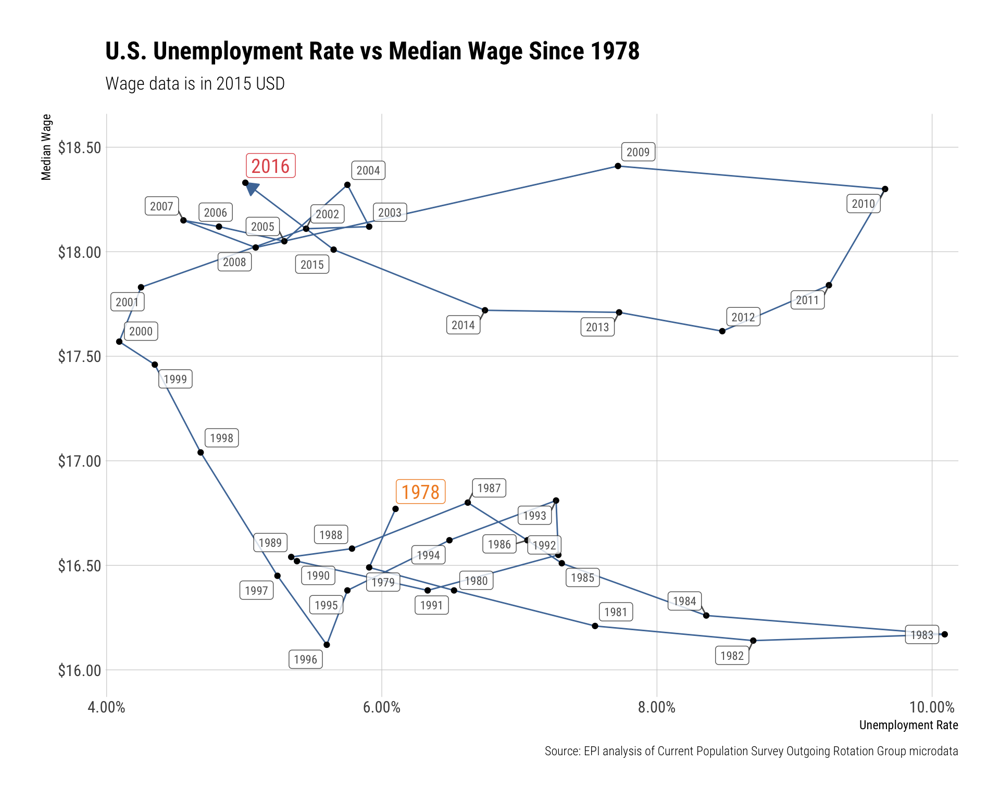

<!-- [](https://travis-ci.org/hrbrmstr/epidata) -->

# epidata

Tools to Retrieve Economic Policy Institute Data Library Extracts

## Description

The [Economic Policy Institute](http://www.epi.org/data/) provides
researchers, media, and the public with easily accessible, up-to-date,
and comprehensive historical data on the American labor force. It is
compiled from Economic Policy Institute analysis of government data
sources. Use it to research wages, inequality, and other economic
indicators over time and among demographic groups. Data is usually
updated monthly.

## What’s Inside The Tin?

The following functions are implemented:

  - `get_annual_wages_and_work_hours`: Retreive CPS ASEC Annual Wages
    and Work Hours
  - `get_annual_wages_by_wage_group`: Annual wages by wage group
  - `get_black_white_wage_gap`: Retreive the percent by which hourly
    wages of black workers are less than hourly wages of white workers
  - `get_college_wage_premium`: Retreive the percent by which hourly
    wages of college graduates exceed those of otherwise equivalent high
    school graduates
  - `get_compensation_wages_and_benefits`: Compensation, wages, and
    benefits
  - `get_employment_to_population_ratio`: Retreive the share of the
    civilian noninstitutional population that is employed
  - `get_gender_wage_gap`: Retreive the percent by which hourly wages of
    female workers are less than hourly wages of male workers
  - `get_health_insurance_coverage`: Retreive Health Insurance Coverage
  - `get_hispanic_white_wage_gap`: Retreive the percent by which hourly
    wages of Hispanic workers are less than hourly wages of white
    workers
  - `get_labor_force_participation_rate`: Retreive the share of the
    civilian noninstitutional population that is in the labor force
  - `get_long_term_unemployment`: Retreive the share of the labor force
    that has been unemployed for six months or longer
  - `get_median_and_mean_wages`: Retreive the hourly wage in the middle
    of the wage distribution
  - `get_minimum_wage`: Minimum wage
  - `get_non_high_school_wage_penalty`: Retreive the percent by which
    hourly wages of workers without a high school diploma (or
    equivalent) are less than wages of otherwise equivalent workers who
    have graduated from high school
  - `get_pension_coverage`: Retreive Pension Coverage
  - `get_poverty_level_wages`: Poverty-level wages
  - `get_productivity_and_hourly_compensation`: Retreive Productivity
    and hourly compensation
  - `get_underemployment`: Retreive the share of the labor force that is
    “underemployed”
  - `get_unemployment`: Retreive the share of the labor force without a
    job
  - `get_unemployment_by_state`: Retreive the share of the labor force
    without a job (by state)
  - `get_union_coverage`: Retreive Union Coverage
  - `get_wages_by_education`: Retreive the average hourly wages of
    workers disaggregated by the highest level of education attained
  - `get_wages_by_percentile`: Retreive wages at ten distinct points in
    the wage distribution
  - `get_wage_decomposition`: Retreive Wage Decomposition
  - `get_wage_ratios`: Retreive the level of inequality within the
    hourly wage distribution.

## Installation

``` r
devtools::install_github("hrbrmstr/epidata")
```

## Usage

``` r
library(epidata)

# current verison
packageVersion("epidata")
## [1] '0.3.0'

get_black_white_wage_gap()
## # A tibble: 46 x 8
##     date white_median white_average black_median black_average gap_median gap_average gap_regression_based
##    <dbl>        <dbl>         <dbl>        <dbl>         <dbl>      <dbl>       <dbl>                <dbl>
##  1  1973         17.6          20.4         13.7          16.0      0.223       0.215              NA     
##  2  1974         17.2          19.9         13.8          15.8      0.198       0.209              NA     
##  3  1975         17.1          20           13.9          15.8      0.191       0.208              NA     
##  4  1976         17.2          20.1         14.0          16.5      0.19        0.182              NA     
##  5  1977         17.2          20.1         13.9          16.2      0.188       0.19               NA     
##  6  1978         17.4          20.1         13.9          16.4      0.201       0.186              NA     
##  7  1979         17.1          20.3         14.3          16.8      0.164       0.173               0.086 
##  8  1980         17.1          19.9         14.1          16.4      0.173       0.174               0.086 
##  9  1981         16.7          19.8         13.8          16.4      0.175       0.174               0.0820
## 10  1982         16.9          20.0         13.7          16.2      0.194       0.191               0.099 
## # … with 36 more rows

get_underemployment()
## # A tibble: 325 x 2
##    date         all
##    <date>     <dbl>
##  1 1989-12-01 0.093
##  2 1990-01-01 0.093
##  3 1990-02-01 0.093
##  4 1990-03-01 0.094
##  5 1990-04-01 0.094
##  6 1990-05-01 0.094
##  7 1990-06-01 0.094
##  8 1990-07-01 0.094
##  9 1990-08-01 0.095
## 10 1990-09-01 0.095
## # … with 315 more rows

get_median_and_mean_wages("gr")
## # A tibble: 46 x 25
##     date median average men_median men_average women_median women_average white_median white_average black_median
##    <dbl>  <dbl>   <dbl>      <dbl>       <dbl>        <dbl>         <dbl>        <dbl>         <dbl>        <dbl>
##  1  1973   17.0    19.7       20.6        23.1         13.0          14.9         17.6          20.4         13.7
##  2  1974   16.6    19.4       20.3        22.7         12.8          14.6         17.2          19.9         13.8
##  3  1975   16.6    19.4       20.7        22.7         12.9          14.8         17.1          20           13.9
##  4  1976   16.6    19.6       20.3        22.9         13.1          15.1         17.2          20.1         14.0
##  5  1977   16.6    19.5       20.5        22.9         13.0          15.0         17.2          20.1         13.9
##  6  1978   16.8    19.6       20.8        23.0         13.0          15.0         17.4          20.1         13.9
##  7  1979   16.5    19.7       20.7        23.2         13.1          15.2         17.1          20.3         14.3
##  8  1980   16.4    19.4       20.5        22.8         13.1          15.1         17.1          19.9         14.1
##  9  1981   16.2    19.2       20.1        22.6         13.1          15.1         16.7          19.8         13.8
## 10  1982   16.1    19.4       20.1        22.8         13.0          15.3         16.9          20.0         13.7
## # … with 36 more rows, and 15 more variables: black_average <dbl>, hispanic_median <dbl>, hispanic_average <dbl>,
## #   white_men_median <dbl>, white_men_average <dbl>, black_men_median <dbl>, black_men_average <dbl>,
## #   hispanic_men_median <dbl>, hispanic_men_average <dbl>, white_women_median <dbl>, white_women_average <dbl>,
## #   black_women_median <dbl>, black_women_average <dbl>, hispanic_women_median <dbl>, hispanic_women_average <dbl>
```

## Extended Example

``` r
library(tidyverse)
library(epidata)
library(ggrepel)
library(hrbrthemes)

unemployment <- get_unemployment()
wages <- get_median_and_mean_wages()

glimpse(wages)
## Observations: 46
## Variables: 3
## $ date    <dbl> 1973, 1974, 1975, 1976, 1977, 1978, 1979, 1980, 1981, 1982, 1983, 1984, 1985, 1986, 1987, 1988, 1989,…
## $ median  <dbl> 16.96, 16.63, 16.64, 16.60, 16.62, 16.77, 16.49, 16.38, 16.21, 16.14, 16.17, 16.26, 16.51, 16.62, 16.…
## $ average <dbl> 19.73, 19.37, 19.41, 19.63, 19.53, 19.57, 19.74, 19.35, 19.24, 19.41, 19.45, 19.52, 19.73, 20.20, 20.…

glimpse(unemployment)
## Observations: 457
## Variables: 2
## $ date <date> 1978-12-01, 1979-01-01, 1979-02-01, 1979-03-01, 1979-04-01, 1979-05-01, 1979-06-01, 1979-07-01, 1979-08…
## $ all  <dbl> 0.061, 0.061, 0.060, 0.060, 0.059, 0.059, 0.059, 0.058, 0.058, 0.058, 0.059, 0.059, 0.059, 0.059, 0.059,…

group_by(unemployment, date=as.integer(lubridate::year(date))) %>%
  summarise(rate=mean(all)) %>%
  left_join(select(wages, date, median), by="date") %>%
  filter(!is.na(median)) %>%
  arrange(date) -> df

cols <- ggthemes::tableau_color_pal()(3)

update_geom_font_defaults(font_rc)

ggplot(df, aes(rate, median)) +
  geom_path(color=cols[1], arrow=arrow(type="closed", length=unit(10, "points"))) +
  geom_point() +
  geom_label_repel(aes(label=date),
                   alpha=c(1, rep((4/5), (nrow(df)-2)), 1),
                   size=c(5, rep(3, (nrow(df)-2)), 5),
                   color=c(cols[2],
                           rep("#2b2b2b", (nrow(df)-2)),
                           cols[3]),
                   family=font_rc) +
  scale_x_continuous(name="Unemployment Rate", expand=c(0,0.001), label=scales::percent) +
  scale_y_continuous(name="Median Wage", expand=c(0,0.25), label=scales::dollar) +
  labs(title="U.S. Unemployment Rate vs Median Wage Since 1978",
       subtitle="Wage data is in 2015 USD",
       caption="Source: EPI analysis of Current Population Survey Outgoing Rotation Group microdata") +
  theme_ipsum_rc(grid="XY")
```


